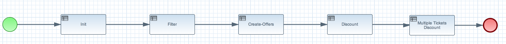
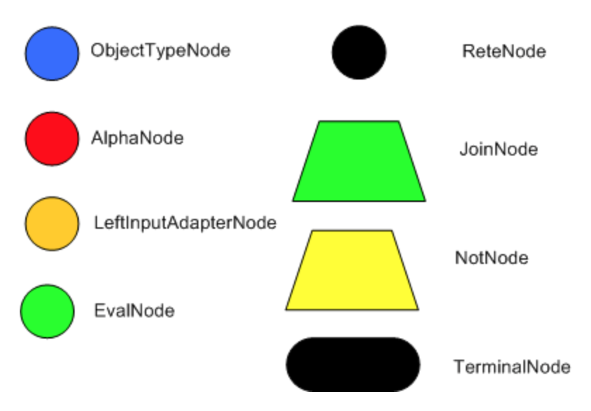
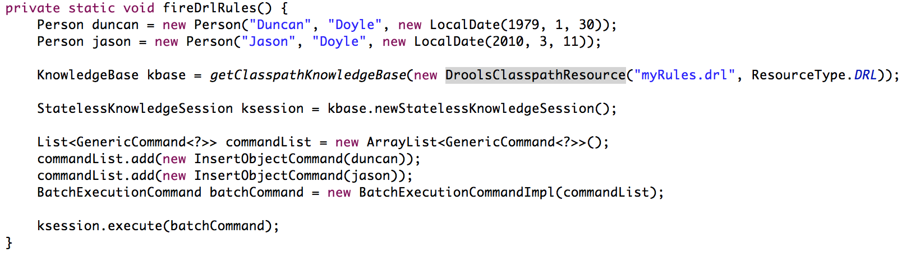

= JBoss BRMS 6.0 Workshop

Rules Engine:: _A business rules engine is a software system that executes one or more business rules in a runtime production environment._ 

== KIE and Drools API

In version 6.x of JBoss BRMS and BPMSuite, the Drools API has changed quite drastically. Common _knowledge_ concepts and APIs have been centralized in the *KIE* API, where KIE stands for *Knowledge Is Everything*.

Furthermore, the platform has focussed on utilizing standards and defacto standards for storage and build management. For example, the new KIE, Drools and jBPM platform heavily utilize *Maven* as the build and
deployment management platform and the BRMS and BPMSuite platforms use *Git* as the source code management system.

=== The KIE API
This paragraph discusses the main KIE API classes. The JavaDoc for the API can be found http://docs.jboss.org/drools/release/latest/kie-api-javadoc/index.html[here].

http://docs.jboss.org/drools/release/latest/kie-api-javadoc/org/kie/api/KieServices.html[KieServices]:: Interface into the KIE API and runtime. Built by the KieServices.Factory: 'KieServices.Factory.get();'
http://docs.jboss.org/drools/release/latest/kie-api-javadoc/org/kie/api/runtime/KieContainer.html[KieContainer]:: Container for KieBases and KieSessions. Provides the API to build new _Stateless_ and _Stateful_ KieSessions.
http://docs.jboss.org/drools/release/latest/kie-api-javadoc/org/kie/api/runtime/KieSession.html[KieSession]:: A Drools/KIE session in which _facts_ and/or _events_ can be inserted and in which _rules_ are executed. A session can be either _Stateful_ or _Stateless_
	http://docs.jboss.org/drools/release/latest/kie-api-javadoc/org/kie/api/runtime/KieSession.html[Stateful KieSession]::: A _KieSession_ is by default _stateful_. This implies that the session retains state until it is expicitly disposed by calling the 'KieSession.dispose()' method.
				This implies that a system can continuously insert facts and fire rules until the session is explicitly disposed.
	http://docs.jboss.org/drools/release/latest/kie-api-javadoc/org/kie/api/runtime/StatelessKieSession.html[Stateless KieSession]::: A _stateless_ KieSession is basically a wrapper around a _stateful_ KieSession. The differences is that one cannot interact with the session.
				The session's 'execute' method can be called only once, after which the session is automatically disposed. Interaction with the session is done by passing Drools 'Command'
				objects to the session. The session is automically disposed after the commands have been executed.
http://docs.oracle.com/javase/6/docs/api/java/util/EventListener.html[EventListeners]:: Drools provides a pluggable EventListener system based on the standard Java EventListener interface. The system provides 3 interfaces:
	http://docs.jboss.org/drools/release/latest/kie-api-javadoc/org/kie/api/event/rule/AgendaEventListener.html[AgendaEventListener]::: Provides listener functionality for _Agenda_ events, e.g. `matchCreated`, `beforeMatchFired`, `afterMatchFired`, `beforeRuleFlowGroupActivated`, etc. This allows one to, for example.
				implement loggers, auditing functionality (which rules have fired) and debugging functionality. In a recent Red Hat Services engagement, this feature was used to implement
				a framework to verify how many rules are covered during a JUnit test run.
	http://docs.jboss.org/drools/release/latest/kie-api-javadoc/org/kie/api/event/rule/RuleRuntimeEventListener.html[RuleRuntimeEventListener]::: Provides listener functionality for _WorkingMemory_ events. These events are fired when objects (facts, events) are inserted in, updated in or removed from the session's WorkingMemory.
	http://docs.jboss.org/drools/release/latest/kie-api-javadoc/org/kie/api/event/process/ProcessEventListener.html[ProcessEventListener]::: Listens to process events like beforeProcessStarted, afterProcessStarted, beforeNodeTriggered, etc. This interface is for example iplemented by the _JPAWorkingMemoryDbLogger_ which is 
				responsible for logging jBPM process data to database for, for example, BAM purposes.
http://docs.jboss.org/drools/release/latest/kie-api-javadoc/org/kie/api/runtime/rule/AgendaFilter.html[AgendaFilter]:: The _AgendeFilter_ interface provides a means to control whether a rule should be fired or not. By implementing the 'boolean accept(Match match)' method, one can control whether the rule firing is accepted for
a given _Match_ or not. This can for example be based on the name of the rule, the facts that caused the rule to match, etc. This interface can for example be used in _JUnit_ tests to only allow the rule under test to fire.

=== Drools Resources
A rulebase can be created from various sources. Drools supports the following resources out of the box:

DRL:: The Drools Rule Language. This the main Drools language. Every rules resource is essentially translated into DRL by the Drools compilers.

DTABLE:: Decision Table implement in Microsoft Excel

DSL and DSLR:: Domain Specific Language. This allows one to write rules in a custom (Domain Specific) rules language. The Drool compiler will translate these rules into DRL. This feature can, for example, be used to 
write rules in a native language. E.g. it has been used in a customer project where rules were written by business people in French.

 +

RDSLR:: Guided rule with DSL. This is a filetype that's created by the JBoss BRMS web-based rule-editors in the KIE WorkBench.

BPMN2:: Business Process Modeling and Notation, a language in which to define business processes. Can be used in BRMS 6 to define so called _RuleFlows_ (which is a supported feature) and in BPMSuite 6 to define jBPM6 business processes.

=== Drools Rule Language: Rule Layout and keywords
A Drools rule basically contains of 3 parts:

Left Hand Side (LHS):: the rule constraints. This is the conditional part of the rule. It consists of zero or more conditional elements. Facts are matched with the conditional elements, and if all elements match, the rule is activated.
Right Hand Sice (RHS):: the rule consequence. This defines the action performed when the rule is fired.
Rule attributes and meta-data:: additional rule attributes that can influence rule odering rule exection, etc.

Drools defines a vast amount of keywords that can be used in the LHS and RHS of the rules. In this section we will discuss a number of these keywords that we will cover in this workshop.
For a complete overview of keywords, please consult the Drools documentation: http://docs.jboss.org/drools/release/6.1.0.Final/drools-docs/html_single/index.html#d0e5393

=== Rule file keywords
* package: defines the package-name of the rulebase (just like a Java package).
* import: import of Java classes to be used in the rules.
* function: this keyword allows us to define a function inside the rulebase.
* declare: allows us to declare fact types directly inside the rulebase definition file instead of in Java. Also allows to add annotations to existing Java classes, for example to mark an existing class as a Drools `Event` (used in Complex Event Processing). 
* global: declare a global variable. This is not a _fact_ inside the workingmemory, so the engine will not reason over _globals_. A global can be used, for example, to store the result of the rule firing (e.g. warnings, errors, filtered tickets, discounts, etc.).

==== attributes
* salience: Defines the order of rule execution. Rules with a higher _salience_ will execute first.
* agenda-group: The name of the agenda-group to which this rule belongs. The rule will only fire if the agenda-group is active.
* ruleflow-group: The name of the ruleflow-group. The rule will only fire when the ruleflow-group is active. In Drools 6, a ruleflow-group is implemented as an agende-group, and the ruleflow BPMN2 model defines the agenda-group stack.
* no-loop: Prevents a rule from re-activating itself.
* lock-on-active: inhibits additional activations of rules in the same agenda-group or ruleflow-group.
* enabled: if set to 'false' disables the rule.
* auto-focus: if set to 'true' the rule will give focus to the agenda-group to which it belongs when the rule matches.

==== conditional elements
* or: is used to group other Conditional Elements into a logical disjunction. Drools supports both prefix or and infix or.
* from: Loads data into the engine from an arbritrary source to be matched by the LHS
* exists: Matches when on one or more instances of a certain type.
* not: Matches when there are no facts within the workingmemory that match the constraint.
* eval: The conditional element eval is essentially a catch-all which allows any semantic code (that returns a primitive boolean) to be executed.
* accumulate: Accumulate allows a rule to iterate over a collection of objects, executing custom actions for each of the elements, and at the end, it returns a result object. It supports both pre-defined accumulate functions,
as well as inline custom code.

=== The Rule Network
The rule network (or graph) defines the reasoning network through which our facts flow. It defines an efficient discrimination network through which data flows. The nodes at the top of the network would have many matches, 
and as we go down the network, there would be fewer matches. At the very bottom of the network are the terminal nodes. In this paragraph we will give a brief introduction to the network and Rete algorithm. For a more in-depth 
explanation please consult the http://docs.jboss.org/drools/release/latest/drools-docs/html/HybridReasoningChapter.html#ReteOO[Drools Manual].

A network consists of various types of nodes.

* ObjectTypeNode: Matches on _Objects_ and can propagate to AlphaNodes, LeftInputAdapterNodes and BetaNodes. AlphaNodes are used to evaluate literal
* AlphaNode: Used to evaluate literal conditions.
* LeftInputAdapterNode: This takes an Object as an input and propagates a single Object Tuple, which can be then fed into a BetaNode.
* BetaNode: Evaluates constraints on two or more facts. The let input is for tuples, the right input is for facts.
** JoinNode (BetaNode): Joins a tuple with a fact, creating a new tuple.
** NotNode (BetaNode): represents the 'not' construct.
** AccumulateNode (BetaNode): represents the 'accumulate' construct.
** ExistsNode(BetaNode): represents the 'exists' construct.
** EvalNode (BetaNode): represents the 'eval' construct.
** TerminalNode: Terminal nodes are used to indicate a single rule having matched all its conditions; at this point we say the rule has a full match.

Here is an example of 2 rules written in DRL and the network/graph it produces:

 

=== ReteOO and PHREAK
Drools was based on the RETE (pronounced: ReeTee), a pattern matching algorithm for implementing production rule systems (http://en.wikipedia.org/wiki/Rete_algorithm). The implementation in Drools is called ReteOO, a 
Java-based RETE algorithm with enhancements. This algorithm is eager in nature, which can lead to much wasted work (where wasted work is classified as matching efforts that don't result in rule-firing). This is demonstrated
by the fact that most of the work in Drools 5 is done during the insert, update and delete actions. I.e. the rules in Drools 5 are not evaluated when calling _fireAllRules_, but when facts are inserted in, updated in and deleted from
the WorkingMemory. Only the Right-Hand-Side of the rules is executed during a 'fireAllRules()' call.

In Drools vesion 6, the _ReteOO_ algorithm was replaced by the _PHREAK_ algorithm, a word-play on Hybrid Reasoning. PHREAK is a lazy evalutation algorithm in which the rule evaluation is done in the 'fireAllRules()' phase 
rather than the insert/update/delete phase. This is done through a goal-oriented, heuristics-based, algorithm: To learn more about _PHREAK_, please consult the following blog-post by the Drools project lead Mark Proctor: http://blog.athico.com/2013/11/rip-rete-time-to-get-phreaky.html

=== Drools and Maven: The KJAR
Up to version 5 of Drools, rules were added to a rulebase via a programming API. The idea was to create a so called _KnowledgeBuilder_ to which various resources were added. Next, this _builder_ was used to 
create a Drools _KnowlegdeBase_ to create a _KnowledgeSession_ (either _Stateful_ or _Stateless_). When creating rule packages via the Drools Guvnor web-interface, rules were compiled into _.pkg_ files, a 
proprietary packaging format.

In version 6, the concept of _convention over configuration_ has been adopted. Proprietary ways of packaging (_.pkg_) has been replaced with a Maven-based packaging approach. In Drools 6, the rule definitions 
are packaged in so called _KJARs_, or _Knowledge JARs_. A _KJAR_ is nothing more than a standard _JAR_ file with a _kmodule.xml_ descriptor in its _META-INF_ directory.

A _kmodule.xml_ allows one to define and configure (named) _KieBases_ and _KieSessions_. For example, we can define which packages in a KJAR are added to a _KieBase_. This allows us to add different rule defintions
to a KJAR and define a separate _KieBase_ per rule resource or per set of rule resources. Furthermore, we can configure the session's _event-mode_, _cloud_ or _stream_ (for Complex Event Processing scenarios). 
We can configure which _clock_ is used by the session (_realtime_ or _pseudo_), and we can define which WorkItemHandlers are configured on a session (which is used in jBPM6 environments) and which listeners we want to attach to a KieSession.

=== Example API usage
As mentioned in the previous section, prior to Drools 6, one required quite a bit of code to build _KnowledgeBase_ and _KnowlegdeSession_, as is shown below:

The next example shows how we can load the same rule-base in Drools 6. Due to the use of _convention over configuration_, the rule-base is automatically created using the configuration in the _kmodule.xml_ descriptor file.
A `KieServices` implementation is retrieved from the `KieServices.Factory` from which a new `KieContainer` is constructed.
The `KieSession` is created by the `KieContainer`, facts are inserted and the rules are fired. After the rule-firing, the _KieSession_ is disposed, releasing the resources.

And another small example:

 KieServices kieServices = KieServices.Factory.get();
 KieContainer kContainer = kieServices.getKieClasspathContainer();
 KieSession kSession = kContainer.newKieSession();
 for( Object fact : facts ) {
      kSession.insert( fact ); 
 } 
 kSession.fireAllRules(); 
 kSession.dispose(); 

=== Dynamically loading rules at runtime
An ofter heared requirement is the ability to dynamically load and/or re-load rules at runtime. A use-case for this is to be able to update rules at runtime without having to restart the application that uses the engine.
In previous versions of Drools this was accomplished by the _KnowledgeAgent_, that would scan a _ChangeSet.xml_ file for changes in the ruleset.

In Drools 6, this is implemented via the `KieScanner`. This scanner periodically scans the Maven repository, from which the KJAR was retrieved (using, for example, an `@ReleaseId` reference), for changes. When a change in 
the KJAR is detected, the KJAR is retrieved from the repository, compiled and configured on the `KieContainer`. When a new session is retrieved from the `KieContainer`, it will use the new `KieBase` with the new rules.

.KieScanner and existing KieSessions
NOTE: When the `KieScanner` finds a new KJAR and the `KieContainer` is updated, only newly created `KieSessions` will use the new rules. Existing `KieSessions` will continue to use the old rule-base.

The link:../Brms6WorkshopKieScannerApp[Brms6WorkshopKieScannerApp] example shows the `KieScanner` functionality. This is an excerpt of the code of that sample application which demonstrates the scanner API:

To run the demo, do the following:

. run _mvn clean install_ on the link:../Brms6WorkshopKieScannerRules[Brms6WorkshopKieScannerRules] project to install the KJAR in your local .m2 repository.
. run _mvn clean install exec:java_ on the link:../Brms6WorkshopKieScannerApp[Brms6WorkshopKieScannerApp] project to start the application. If the app has been started correctly, it will print the line _Found person: Duncan_ every 5 seconds.
. alter the rule in the link:../Brms6WorkshopKieScannerRules/src/main/resources/rules.drl[rules.drl] file in the link:../Brms6WorkshopKieScannerRules[Brms6WorkshopKieScannerRules] project. For example, change the text in the `System.out.println` in the RHS of the rule. 
Run _mvn clean install_. This will install a new version of the KJAR in your local .m2 repository.
. Check the output if the _Brms6WorkshopKieScannerApp_ that is still running. If everything has been done correctly, the `KieScanner` should automatically pick-up the new KJAR and start processing the data with the new rules.

=== Playtime
Now that we've seen some of the Drools APIs, and some of the capabilities, let's start playing with some code and rules. The *Brms6WorkshopRules* project contains a _Main_ class which demonstrates how to use the KIE API
to load a simple rulebase and create a KieSession. It demonstrates how _facts_ can be inserted into the session, rules can be fired and how results can be retrieved.

Rules are implemented in 3 different ways:

. DRL
. DTABLE / Microsoft Excel
. DSL and DSLR

We'll go through these concepts one-by-one in order to get a feel of how the engine works. Feel free to add new rules to the rule definitions and to experiment with the API.

== Drools Expert Labs
These Drools Expert labs aim to build-up a small rulebase for a ticket ordering system. The lab starts with a small, pre-defined fact-model and a simple rule-base.
The idea is to gradually expand the rule-base and add new features using more sophisticated Drools concepts, effectively building new and more sophisticated functionality.

=== Fact Model
The _fact model_ contains the classes that define the facts over which the rules will reason. We will create objects from these classes and inject them into the Drools WorkingMemory (session).

The examples are modelled around an  online ticketing system. The rules are responsible for filtering out tickets that are not available to a certain person (e.g. under age) and applying initial discount to the ticket prices 
(e.g. the person has a discount pass, the person is under age, etc.). To do this, we insert 3 types of facts into the session:

. `Ticket`
. `Person`
. `EventPass`

The result, which is a list of `TicketOffer`s with the tickets available for this `Person`, including calculated discount. This is passed into the global `TicketOffer`s.

=== The implementation
The main logic in these labs is defined in the *Brms6WorkshopTicketsUseCaseRulesMain* project. It contains the logic to build a `KieContainer` and `KieSession`, creates the fact objects, inserts them into the `KieSession` 
and fires the rules. The various other projects define the ruleset(s) that are used at runtime. We will start with a very simple rulebase with just 2 rules, and gradually build up a more complex set of rules.

==== Lab 1
We start with 2 simple rules in *Brms6WorkshopTicketsUseCaseRules1*, one that creates the `TicketOffer`s, and one that filters out the tickets for people below the age of 18. Execute the application by running 
the `Main` class. Observe the output. What is wrong with our rulebase? Can you fix it? How? 

A possible solution is implemented in *Brms6WorkshopTicketsUseCaseRules2*.

==== Lab 2
Start with the *Brms6WorkshopTicketsUseCaseRules2* project. We will now implement a rule filters out all tickets out all tickets with 'TICKET_CLASS.GOLD' if our `Person` does not have an `EventPass`. 
I.e. we only allow people with a special event-pass to purchase these tickets.

A possible solution is implemented in *Brms6WorkshopTicketsUseCaseRules3*.

==== Lab 3
Start with the *Brms6WorkshopTicketsUseCaseRules3* project. In this lab implement 2 discount rules. The first rule gives a 25% discount for on all tickets for non-adults (people below the age of 18) and the second rule applies
a 10% discount on all tickets for people with an `EventPass`.

First try to implement a single rule and observe what happens. If you encounter an issue, try to solve this issue first. Then implement the second discount rule. Again, if any problems occur, try to solve them. Feel free to share 
anything you encounter with the group. We're here to learn :-)

Again, a possible solution is implemented in *Brms6WorkshopTicketsUseCaseRules4*.

=== Lab 4
Start with the *Brms6WorkshopTicketsUseCaseRules4* project. If all is well, we have now got 2 rules in our ruleset that check on the same constraint, namely if a `Person` is under the age of 18.
 One of the powers of Drools is the possibility to infer new data (facts) in rules, and add this new inferred data as a constraint to other rules. We're going to apply this technique in this lab.

In our fact model, we have a class called `IsAdult`. Create a new rule that infers this fact from the facts entered into working memory, and inserts this new fact into the engine. Next, use this new fact in the constraint of the rules that check if a person is underage.

A possible solution is implemented in *Brms6WorkshopTicketsUseCaseRules5*.

=== Lab 5
Start with the *Brms6WorkshopTicketsUseCaseRules5* project. We've heavily used the 'salience' keyword in our rules to define rule execution ordering. Using 'salience' is however very error-prone. A better solution is to group rules
into various 'agenda-groups', and control the order of execution of the rules by setting the focus on the correct agenda-group.

Group the rules in 4 different 'agenda-groups': init, filter, create-offers and discount. Next, create a rule that fires first (in the _init_ 'agenda-group') and set the focus of the agende-groups in the RHS (consuquence) of the rule.
The code to set the focus of an 'agenda-group' in the RHS of a rule is: `kcontext.getKnowledgeRuntime().getAgenda().getAgendaGroup("init").setFocus();`

Note that the 'agenda-group' is a stack-based system on which we push and from which we pop agenda-groups.

A possible solutions is implemented in *Brms6WorkshopTicketsUseCaseRules6*.

=== Lab 6
Start with the *Brms6WorkshopTicketsUseCaseRules6* project. Instead of 'agenda-group', we will now define the ordering of the rule execution with a BPMN2 RuleFlow. Change the implementation into one 
that use a RuleFlow and `ruleflow-group`.

A solution is implemented in the *Brms6WorkshopTicketsUseCaseRules7* project.

=== Lab 7
Start with the *Brms6WorkshopTicketsUseCaseRules7* project. In the current rulebase, the discount values are statically defined. We however want to retrieve these discounts from a Service. Therefore, we've added the `DiscountService` 
Java class to our project. Use this class to retrieve the discount values for 2 discount rules. Hint: Use the `from` keyword.

A solution is implemented in the *Brms6WorkshopTicketsUseCaseRules8* project.

=== Lab 8
Start with the *Brms6WorkshopTicketsUseCaseRules8* project. We will now implement our final 2 rules. The requirement is that we add an additional 5% discount to all tickets if the number of TicketOffers returned is equal to or more than 8.

Hint: Use an `accumulate` function.

NOTE: This is a bit of strange use-case. Normally a discount like this would be applied if someone would order an x-amount of tickets. However, this would require me to implement the actual process in which the _Person_ actually selects
a number of _TicketOffers_ which he wants to buy, which is a bit more work to implement. I still wanted to showcase the 'accumulate' function without implementing this extra process, hence this rather weird use-case ;-).
